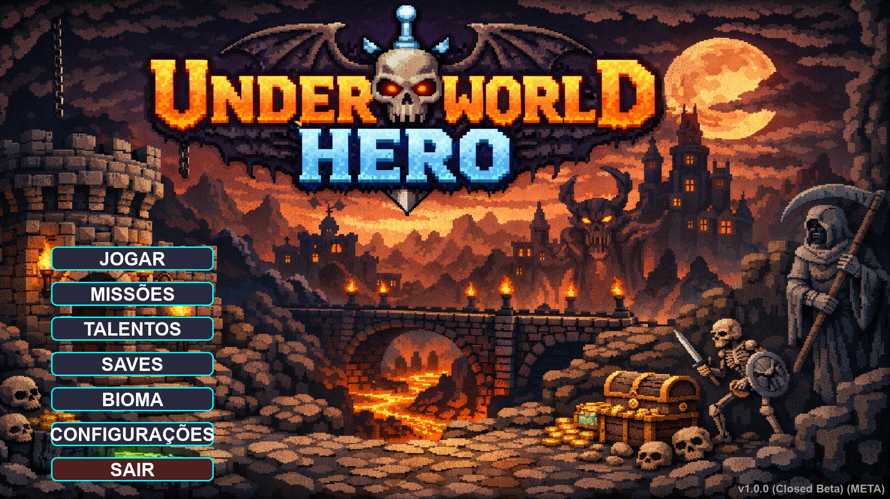

# ⚔️ Nome do Seu Jogo (Ex: Mystic Survivor)


Um emocionante jogo de sobrevivência estilo *bullet hell* desenvolvido inteiramente em Python com a biblioteca Pygame. Enfrente hordas de inimigos, suba de nível, escolha suas magias e desbloqueie novos heróis!

---

## 🎮 Funcionalidades Principais

* **Sistema de Personagens:** Escolha entre diferentes classes (Guerreiro, Mago, Caçador) com atributos únicos.
* **Progressão Dinâmica:** Suba de nível e escolha upgrades de status (Dano, Vida, Velocidade).
* **Sistema de Magias:** Incluindo a poderosa magia de Explosão com animações fluidas.
* **Menu de Configurações Completo:** Ajuste volume, resolução, controles e opções de acessibilidade.
* **Persistência de Dados:** Sistema de Save/Load para manter seu progresso e conquistas.
* **Biomas Diversos:** Escolha onde lutar, com diferentes inimigos e desafios.

---

## 🛠️ Tecnologias Utilizadas

* **Linguagem:** Python 3.12
* **Biblioteca Gráfica:** Pygame
* **Armazenamento:** JSON (para saves e configurações)
* **Versionamento:** Git & GitHub

---

## 🚀 Como Executar o Jogo

### Pré-requisitos
Certifique-se de ter o Python 3.12 instalado.

1.  **Clone o repositório:**
    ```bash
    git clone [https://github.com/seu-usuario/seu-repositorio.git](https://github.com/seu-usuario/seu-repositorio.git)
    cd seu-repositorio
    ```

2.  **Crie um ambiente virtual:**
    ```bash
    python -m venv .venv
    ```

3.  **Ative o ambiente:**
    * Windows: `.venv\Scripts\activate`
    * Linux/Mac: `source .venv/bin/activate`

4.  **Instale o Pygame:**
    ```bash
    pip install pygame
    ```

5.  **Inicie o jogo:**
    ```bash
    python jogo_final.py
    ```

---

## ⌨️ Comandos Básicos

| Ação | Tecla (Padrão) |
| :--- | :--- |
| Movimentação | W, A, S, D |
| Pausar Jogo | ESC |
| Interagir | E / Clique Mouse |
| Usar Magia | Automático / Espaço |

---

## 📝 Roadmap de Desenvolvimento

- [x] Sistema básico de movimentação e combate.
- [x] Animações de magias (Explosão).
- [x] Menu de configurações e acessibilidade.
- [ ] Adicionar sistema de missões diárias com Timer.
- [ ] Implementar mais biomas e chefes finais.
- [ ] Versão executável (.exe) para Windows.

---

## 📄 Licença

Este projeto está sob a licença [MIT](LICENSE).

---
Desenvolvido com ☕ e Python por Hélio Júnior


<p align="center">
  
</p>